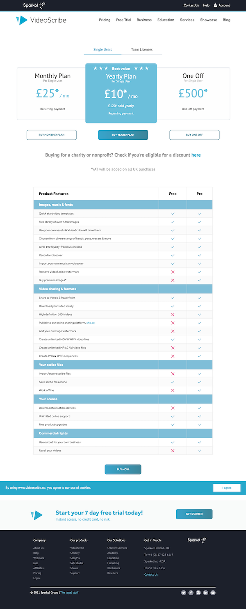
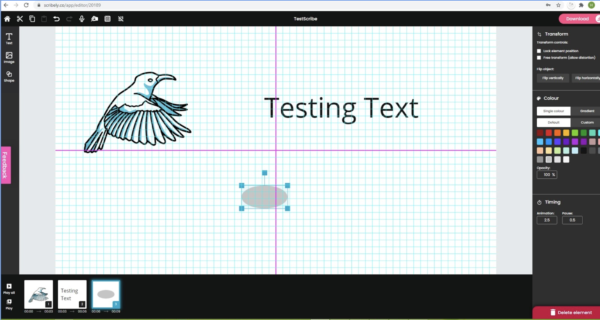
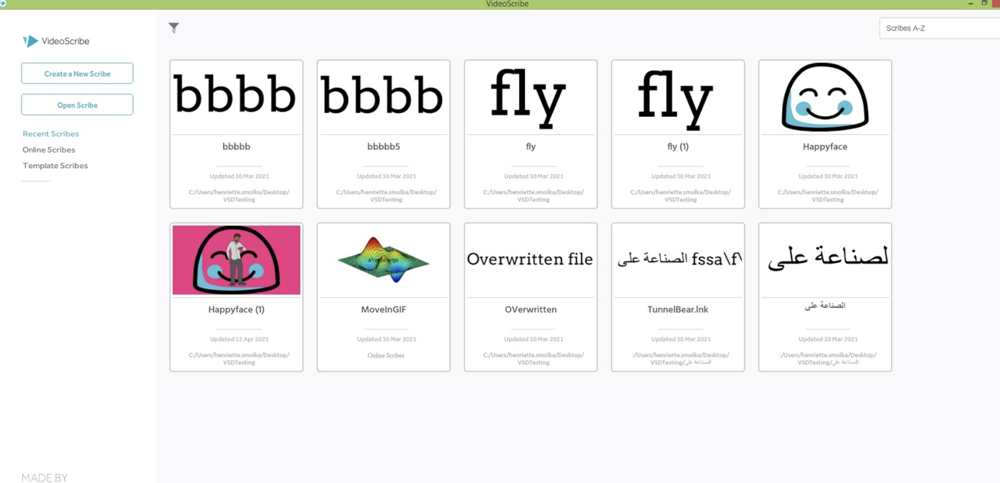

# Sparkol Tester Test

Thank you for taking the time to complete our short test. The test is composed of two sections. The first covers how you would approach some  test scenarios, and the second is includes some general testing questions.

## Section 1: Scenarios

1. What test cases would you write for our buy page [https://www.videoscribe.co/en/buy](https://www.videoscribe.co/en/buy):

2. What test cases would you write for our checkout page [https://www.videoscribe.co/en/Checkout](https://www.videoscribe.co/en/Checkout):

3. What functional test cases would you write to cover this section of our product [https://www.scribely.co](https://www.scribely.co):
   

4. What test cases would you consider for this app [https://www.videoscribe.co](https://www.videoscribe.co):

- What do you think about the overall quality of our [https://www.videoscribe.co](https://www.videoscribe.co) website?
  

## Section 2: General questions

- How will you decide when to automate the test?

- What do you do in the planning phase of automation?

- Can you automate captcha/recaptcha (e.g. [https://www.google.com/recaptcha/about/](https://www.google.com/recaptcha/about/) )

- What are the phases involved in Software Testing Life Cycle?

- What information would you expect to have in a user story

- What information would you have in a defect
